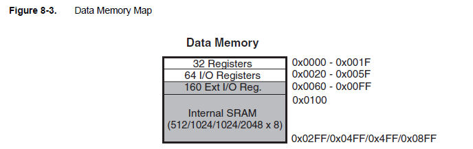

# Assembler - C program

This example aims to show how to create a function in c that calls a function in assembler that itself call a c function.

Infos :

Interesting map to explain how to build a program in c/asm : 
    - https://www.avrfreaks.net/forum/avr-gcc-compiling-linking-and-assembly
    - Advanced C / Assembly Mixing : https://www.avrfreaks.net/forum/advanced-c-assembly-mixing

Data memory :

Build : 
- `main.cpp` : `C:/Users/ldade/.platformio/packages/toolchain-atmelavr/bin/avr-gcc.exe -mmcu=atmega328p -DF_CPU=16000000L -DPLATFORMIO=50101 -DARDUINO_AVR_PRO -Iinclude -Isrc -O2 -c src/main.cpp -o .pio\build\pro16MHzatmega328\src\main.cpp.o`
- `main.asm` : `C:/Users/ldade/.platformio/packages/toolchain-atmelavr/bin/avr-gcc -x assembler-with-cpp -Os -Wall -ffunction-sections -fdata-sections -flto -mmcu=atmega328p -DF_CPU=16000000L -DPLATFORMIO=50101 -DARDUINO_AVR_PRO -Iinclude -Isrc -c src\main.asm -o .pio\build\pro16MHzatmega328\src\main.asm.o`

Preprocessor only :

- `main;asm` : `C:/Users/ldade/.platformio/packages/toolchain-atmelavr/bin/avr-gcc.exe -x assembler-with-cpp -Os -Wall -ffunction-sections -fdata-sections -flto -mmcu=atmega328p -DF_CPU=16000000L -DPLATFORMIO=50101 -DARDUINO_AVR_PRO -Iinclude -Isrc -c src/main.asm -E -o main.asm.i`

**TODO**
- `main.cpp` : `C:/Users/ldade/.platformio/packages/toolchain-atmelavr/bin/avr-g++ -o .pio\build\pro16MHzatmega328\src\main.o -c -Wno-error=narrowing -fno-exceptions -fno-threadsafe-statics -fpermissive -std=gnu++11 -Os -Wall -ffunction-sections -fdata-sections -flto -mmcu=atmega328p -DF_CPU=16000000L -DPLATFORMIO=50101 -DARDUINO_AVR_PRO -Iinclude -Isrc src\main.cpp`

Link : 
`C:/Users/ldade/.platformio/packages/toolchain-atmelavr/bin/avr-gcc -o .pio\build\pro16MHzatmega328\firmware.elf .pio\build\pro16MHzatmega328\src\main.cpp.o .pio\build\pro16MHzatmega328\src\main.asm.o -L.pio\build\pro16MHzatmega328`

Complete :
`C:/Users/ldade/.platformio/packages/toolchain-atmelavr/bin/avr-gcc -o .pio\build\pro16MHzatmega328\firmware.elf -Os -mmcu=atmega328p -Wl,--gc-sections -flto -fuse-linker-plugin .pio\build\pro16MHzatmega328\src\main.c.o .pio\build\pro16MHzatmega328\src\main.asm.o -L.pio\build\pro16MHzatmega328 -Wl,--start-group -lm -Wl,--end-group`

Diagnostic : 

Main.cpp :
- S : `C:/Users/ldade/.platformio/packages/toolchain-atmelavr/bin/avr-gcc.exe -mmcu=atmega328p -DF_CPU=16000000L -DPLATFORMIO=50101 -DARDUINO_AVR_PRO -Iinclude -Isrc -O2 -c src/main.cpp -o main.cpp.s -S`

- E : `C:/Users/ldade/.platformio/packages/toolchain-atmelavr/bin/avr-gcc.exe -mmcu=atmega328p -DF_CPU=16000000L -DPLATFORMIO=50101 -DARDUINO_AVR_PRO -Iinclude -Isrc -O2 -c src/main.cpp -o main.cpp.i -E`

Nm:
- `C:\Users\ldade\.platformio\packages\toolchain-atmelavr\bin\avr-gcc-nm.exe .pio\build\pro16MHzatmega328\src\main.asm.o`
- `C:\Users\ldade\.platformio\packages\toolchain-atmelavr\bin\avr-gcc-nm.exe .pio\build\pro16MHzatmega328\src\main.cpp.o`

Readelf : `C:\Users\ldade\.platformio\packages\toolchain-atmelavr\bin\avr-readelf.exe -a .pio\build\pro16MHzatmega328\firmware.elf`

And store : `C:\Users\ldade\.platformio\packages\toolchain-atmelavr\bin\avr-readelf.exe -a .pio\build\pro16MHzatmega328\firmware.elf > firmware.elf.txt`

Upload : 
- `C:\Users\ldade\.platformio\packages\toolchain-atmelavr\bin\avrdude -v -p atmega328p -C C:\Users\ldade\.platformio\packages\tool-avrdude\avrdude.conf -c arduino -b 57600 -D -P "COM3" -U flash:w:.pio\build\pro16MHzatmega328\firmware.hex:i `

Change build command : https://docs.platformio.org/en/latest/core/quickstart.html