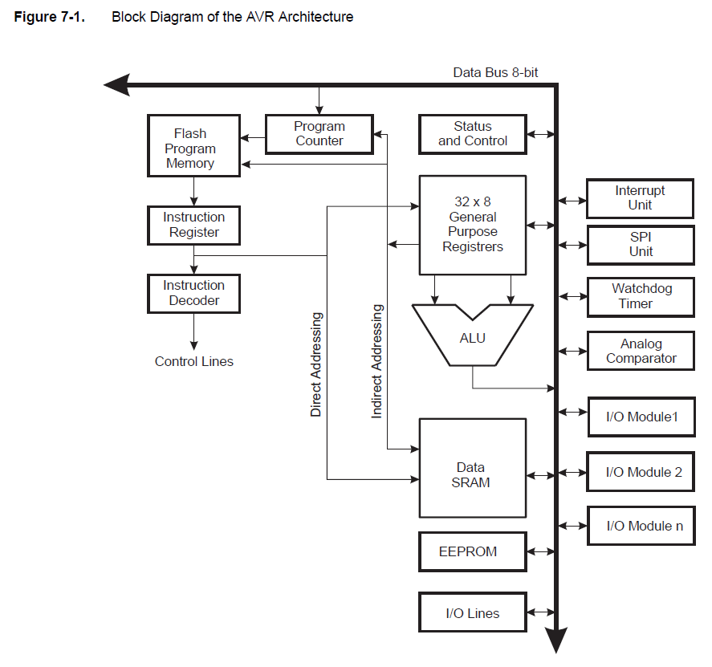
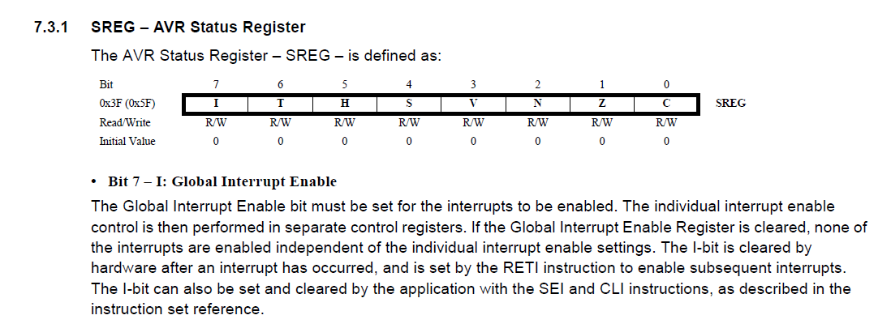
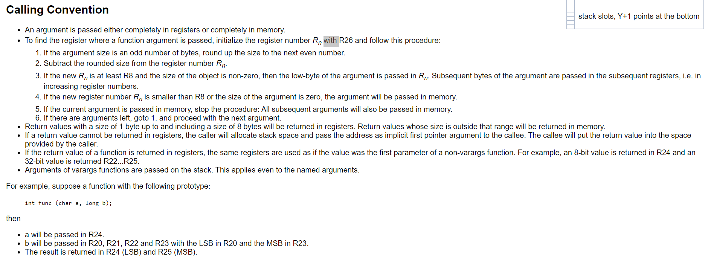
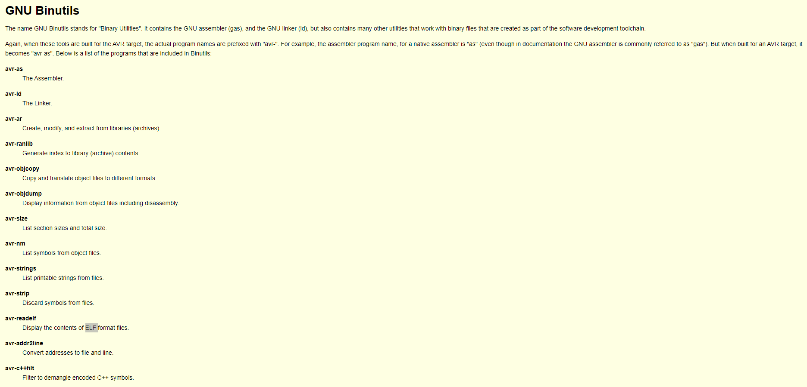
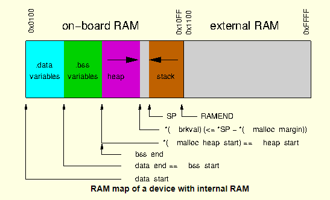

# Assembler - C program

This example aims to show how to create a function in c that calls a function in assembler that itself call a c function.

Ideas & todos :
- create a function with several parameters
- pointer to a value as parameter, pointer to a function as parameter
- handle static memory in assembler (bottom of stack)
- think about multithreading and stacks (+ size)
- confirm that optmization option -Os if for space optimization and -O2 is for time optimization

## General

Official *avr-libc* (Standard C library for AVR-GCC Search) user manual : https://www.gnu.org/savannah-checkouts/non-gnu/avr-libc/user-manual/pages.html

**Steps** : Preprocessor / building / linking / flashing

### Sources:
- General :
    - Toolchain overview : https://www.gnu.org/savannah-checkouts/non-gnu/avr-libc/user-manual/overview.html
- From *avr-libc* user manual :
    - *sections* : https://www.gnu.org/savannah-checkouts/non-gnu/avr-libc/user-manual/mem_sections.html
    - *malloc* : https://www.gnu.org/savannah-checkouts/non-gnu/avr-libc/user-manual/malloc.html#malloc_extram
- Interesting map to explain how to build a program in c/asm : 
    - https://www.avrfreaks.net/forum/avr-gcc-compiling-linking-and-assembly
    - Advanced C / Assembly Mixing : https://www.avrfreaks.net/forum/advanced-c-assembly-mixing
- Name mangling : name mangling : 
    - https://stackoverflow.com/questions/39934392/avr-gcc-not-linking-c-with-assembly-function
    - wikipedia : https://en.wikipedia.org/wiki/Name_mangling
- Library reference : https://www.gnu.org/savannah-checkouts/non-gnu/avr-libc/user-manual/modules.html
    - Interrupts : https://www.gnu.org/savannah-checkouts/non-gnu/avr-libc/user-manual/group__avr__interrupts.html

### ATmega328p informations

| Device | Flash | EEPROM | RAM | Interrupt Vector Size |
|---|---|---|---|---|
| ATmega328P | 32KBytes | 1KBytes | 2KBytes | 2 instruction words/vector |

### Screenshots from ATmega328p datasheet, avr instructions manual or avr-libc manual

AVR architecture : 

Interrupt flag

Data memory :

Calling convention : https://gcc.gnu.org/wiki/avr-gcc

Binutils : https://www.gnu.org/savannah-checkouts/non-gnu/avr-libc/user-manual/overview.html

Ran on ATmega168 :

## Ubuntu 

Its more convenient to build this project using Ubuntu WSL2 when working on Windows

Installing avr toolchain : `sudo apt-get install gcc-avr binutils-avr avr-libc` (+ debugger/emulator : `sudo apt-get install gdb-avr`)

Install avr *avr-libc* libraries with command : `sudo apt-get install avr-libc gcc-avr`

Install avrdude (to flash program on the arduino) : `sudo apt install avrdude`

Go to the project directory `cd /mnt/c/Users/ldade/Documents/ProjetsRecherche/Embedded/ATmega328p-assembler-c`

Run the build script : `./scripts/build.sh`

The script also generate the following files :
- Display the contents of ELF format files : *firmware.elf.txt*
- Disassembly : *disassembly.s*, 
- Preprocessor only on sources : *main.cpp.i* & *main.asm.i*
- List symbols from object files : *main.cpp.nm* & *main.asm.nm*

---

## Windows - VS Code w PlatformIO : Obsolete

Build : 
- `main.cpp` : `C:/Users/ldade/.platformio/packages/toolchain-atmelavr/bin/avr-gcc.exe -mmcu=atmega328p -DF_CPU=16000000L -DPLATFORMIO=50101 -DARDUINO_AVR_PRO -Iinclude -Isrc -O2 -c src/main.cpp -o .pio\build\pro16MHzatmega328\src\main.cpp.o`
- `main.asm` : `C:/Users/ldade/.platformio/packages/toolchain-atmelavr/bin/avr-gcc -x assembler-with-cpp -Os -Wall -ffunction-sections -fdata-sections -flto -mmcu=atmega328p -DF_CPU=16000000L -DPLATFORMIO=50101 -DARDUINO_AVR_PRO -Iinclude -Isrc -c src\main.asm -o .pio\build\pro16MHzatmega328\src\main.asm.o`

Preprocessor only :

- `main;asm` : `C:/Users/ldade/.platformio/packages/toolchain-atmelavr/bin/avr-gcc.exe -x assembler-with-cpp -Os -Wall -ffunction-sections -fdata-sections -flto -mmcu=atmega328p -DF_CPU=16000000L -DPLATFORMIO=50101 -DARDUINO_AVR_PRO -Iinclude -Isrc -c src/main.asm -E -o main.asm.i`

**TODO**
- `main.cpp` : `C:/Users/ldade/.platformio/packages/toolchain-atmelavr/bin/avr-g++ -o .pio\build\pro16MHzatmega328\src\main.o -c -Wno-error=narrowing -fno-exceptions -fno-threadsafe-statics -fpermissive -std=gnu++11 -Os -Wall -ffunction-sections -fdata-sections -flto -mmcu=atmega328p -DF_CPU=16000000L -DPLATFORMIO=50101 -DARDUINO_AVR_PRO -Iinclude -Isrc src\main.cpp`

Link : 
`C:/Users/ldade/.platformio/packages/toolchain-atmelavr/bin/avr-gcc -o .pio\build\pro16MHzatmega328\firmware.elf .pio\build\pro16MHzatmega328\src\main.cpp.o .pio\build\pro16MHzatmega328\src\main.asm.o -L.pio\build\pro16MHzatmega328`

Complete :
`C:/Users/ldade/.platformio/packages/toolchain-atmelavr/bin/avr-gcc -o .pio\build\pro16MHzatmega328\firmware.elf -Os -mmcu=atmega328p -Wl,--gc-sections -flto -fuse-linker-plugin .pio\build\pro16MHzatmega328\src\main.c.o .pio\build\pro16MHzatmega328\src\main.asm.o -L.pio\build\pro16MHzatmega328 -Wl,--start-group -lm -Wl,--end-group`

Diagnostic : 

Main.cpp :
- S : `C:/Users/ldade/.platformio/packages/toolchain-atmelavr/bin/avr-gcc.exe -mmcu=atmega328p -DF_CPU=16000000L -DPLATFORMIO=50101 -DARDUINO_AVR_PRO -Iinclude -Isrc -O2 -c src/main.cpp -o main.cpp.s -S`

- E : `C:/Users/ldade/.platformio/packages/toolchain-atmelavr/bin/avr-gcc.exe -mmcu=atmega328p -DF_CPU=16000000L -DPLATFORMIO=50101 -DARDUINO_AVR_PRO -Iinclude -Isrc -O2 -c src/main.cpp -o main.cpp.i -E`

Nm:
- `C:\Users\ldade\.platformio\packages\toolchain-atmelavr\bin\avr-gcc-nm.exe .pio\build\pro16MHzatmega328\src\main.asm.o`
- `C:\Users\ldade\.platformio\packages\toolchain-atmelavr\bin\avr-gcc-nm.exe .pio\build\pro16MHzatmega328\src\main.cpp.o`

Readelf : `C:\Users\ldade\.platformio\packages\toolchain-atmelavr\bin\avr-readelf.exe -a .pio\build\pro16MHzatmega328\firmware.elf`

And store : `C:\Users\ldade\.platformio\packages\toolchain-atmelavr\bin\avr-readelf.exe -a .pio\build\pro16MHzatmega328\firmware.elf > firmware.elf.txt`

Upload : 
- `C:\Users\ldade\.platformio\packages\toolchain-atmelavr\bin\avrdude -v -p atmega328p -C C:\Users\ldade\.platformio\packages\tool-avrdude\avrdude.conf -c arduino -b 57600 -D -P "COM3" -U flash:w:.pio\build\pro16MHzatmega328\firmware.hex:i `

Change build command : https://docs.platformio.org/en/latest/core/quickstart.html